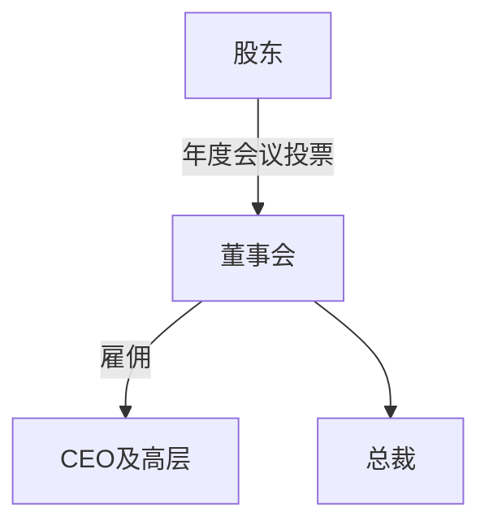

Stephen Schwarzman **苏世民**
* 风格：强硬，不固守常规，注重实证研究
* 1985年创建最大的私募股权公司[黑石集团](https://www.blackstone.com/)
# 股票

### 发行总数
* 股票分割(将一张股票拆为两张)
	* 目的：美国公司股票分割的目的是将股票价格维持在20-40美元之间

### 摊薄
公司非对称地改变股数，特指股票数量受到影响，不利于已持股的股东。
	
	股票分割并不是摊薄，因为并无实质性（比例）变化。

### 股利
董事会会决定何时向股东支付股利（平股平权）
* 公司分红之后，股票价格会下跌
* 发放股利的原因：公司有利好消息要公布，比如实现业绩突破

新公司一般不会发放股利，成熟期会支付股利。
	
	市盈率指每股市价除以每股盈利（Earnings Per Share，EPS），通常作为股票是便宜抑或昂贵的指标通货膨胀会使每股收益虚增，从而扭曲市盈率的比较价值）。
	市盈率把企业的股价与其制造财富的能力联系起来。
	每股盈利的计算方法，一般是以该企业在过去一年的净利润除以总发行已售出股数。

* **股利发放率**：股利/收益
	>大萧条期间，股利发放率为160倍

### 除息
停止过户期内，股息红利仍发入给登记在册的旧股东，新买进股票的持有者因没有过户就不能享有领取股息红利的权利，这就称为**除息**。
同时股票买卖价格就应扣除这段时期内应发放股息红利数，这就是**除息**交易。

	股票除息日，股价前会加“*”标记。
一般来说投资者不需要考虑除息日。
>[FINRA美国金融业监管局](http://www.finra.org/)

### 回购股票
上市公司利用现金等方式，从股票市场上购回本公司发行在外的一定数额的股票的行为。
	
	公司在股票回购完成后可以将所回购的股票注销。
	但在绝大多数情况下，公司将回购的股票作为“库藏股”保留，仍属于发行在外的股票，但不参与每股收益的计算和分配。
	库藏股日后可移作他用，如发行可转换债券、雇员福利计划等，或在需要资金时将其出售。

对投资者来说，股票回购和分红是可替代的。

	2003年《就业与进一步减税协调法案》，将股利税率减至15%,与资本收益的征税率相同。

### 股票清偿
指公司破产或解散时，对原股东持有的股票价值进行偿还。

## MM模型
### MM模型与股利无关性
>如果公司有大笔借债，则称之为有杠杆性。

杠杆率=负债权益比（债务/股票总价值）
* 一家公司有杠杆性后，风险增大
	* 如果负债与收入高度相关，则公司风险性很高 

### 负债不相关性定律
在不考虑税务和其他因素的条件下，公司的真实价值不会受到筹资方式的影响。

* 修正
	* 在征收企业所得税时，负债是免税的。
		* 所以公司愿意大量负债-->公司会提高负债权益比
	* 破产成本
		* 一家公司必须在租税考量和破产成本之间进行权衡，并得出最有利的负债权益比。

## 分红理论(John Lintner)
	除去税收的干扰，股利政策对公司是无相关性的。
* 股东们的观点：
	* 如果开始分红，就必须一直分红，否则会被视为经营不善。
	* 如果收益提高，会努力维持既定的股利发放率；
	* 如果收益大涨，不会马上提高股利——这会导致过高的期望。会有限增加分红。
	
### 林特纳股利模型

	后发展为戈登的“在手之鸟”理论。
	
* 既定的股利发放率τ
* 调整参数ρ,(0<ρ<1)：向目标调整的速率

计算公式
$$Div_t-Div_{t-1}=\rho(E_t-Div_{t-1})$$
>Div股利
>E收益

