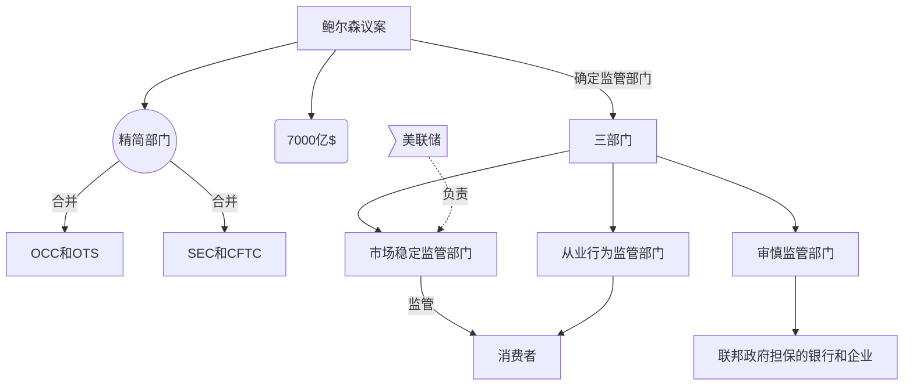

# 投资银行和二级市场
## 次贷危机解读
### 保尔森Paulson议案(又名[《经济稳定紧急法案》](https://zh.wikipedia.org/wiki/%E7%B6%93%E6%BF%9F%E7%A9%A9%E5%AE%9A%E7%B7%8A%E6%80%A5%E6%B3%95%E6%A1%88)），
财政部签署，对金融进行重大改革——“目标导向的监管”， 2008.10通过
- 大部分由[David Nason](https://en.wikipedia.org/wiki/David_Nason)（曾为鲍尔森智囊，现为通用总裁+CEO）撰写
  
- 内容：
	- 议案内**三部门**应当有各自的监管目标
		- **市场稳定监管部门**:监管市场不会出现失控，不会产生系统性危机，美联储
      
		- **审慎监管部门**：保障在政府担保的各类金融机构中，美国的国家利益
      
		- **从业行为监管部门**：保护消费者
      
	- 精简监管机构
    
		- 合并**货币监理署OCC**（监管国民银行）和**储蓄机构监理局OTS**（监管储蓄银行）  
		- 合并**证券交易委员会SEC**(证券行业主要的政府监管部门)和**商品期货交易委员会CFTC**（监管期货市场）

### [国际清算银行](https://www.bis.org/)
- 职能
	-  推进国际货币政策的对话和实施
	-  经济和货币政策研究中心
	- 中央银行支付体系
	-  执行国际金融业务的保管
- 次贷危机期间，其数据显示有52万亿$信用违约掉期未结算
### 评论
经历过金融危机的国家比没经历过的国家发展更为成功，金融危机是伴随社会高速发展和财富迅速积累的一种标志。

## 投资银行
一个完整的投资银行包括了重组、并购、企业融资、证券发行、承销、研究、投资咨询、经纪、资产管理、财富管理等一系列业务，但也有的只专精于某几个方面的业务。
**声誉极为重要，类似厂牌。**

知名投行：
1.  [摩根大通](https://zh.wikipedia.org/wiki/%E6%91%A9%E6%A0%B9%E5%A4%A7%E9%80%9A "摩根大通")  JP Morgan
2.  [高盛](https://zh.wikipedia.org/wiki/%E9%AB%98%E7%9B%9B "高盛")  Goldman Sachs
3.  [美银美林银行](https://zh.wikipedia.org/wiki/%E7%BE%8E%E9%93%B6%E7%BE%8E%E6%9E%97%E9%9B%86%E5%9B%A2 "美银美林集团")  Bank of America Merrill Lynch BAML
4.  [摩根士丹利](https://zh.wikipedia.org/wiki/%E6%91%A9%E6%A0%B9%E5%A3%AB%E4%B8%B9%E5%88%A9 "摩根士丹利")  Morgan Stanley
5.  [花旗银行](https://zh.wikipedia.org/wiki/%E8%8A%B1%E6%97%97%E9%93%B6%E8%A1%8C "花旗银行")  Citigroup
6.  [巴克莱银行](https://zh.wikipedia.org/wiki/%E5%B7%B4%E5%85%8B%E8%8E%B1%E9%93%B6%E8%A1%8C "巴克莱银行")  Barclays Capital
7.  [瑞士信贷](https://zh.wikipedia.org/wiki/%E7%91%9E%E5%A3%AB%E4%BF%A1%E8%B4%B7%E9%9B%86%E5%9C%98 "瑞士信贷集团")  Credit Suisse Group
8.  [德意志银行](https://zh.wikipedia.org/wiki/%E5%BE%B7%E6%84%8F%E5%BF%97%E9%93%B6%E8%A1%8C "德意志银行")  Deutsche Bank
9.  [富国银行集团](https://zh.wikipedia.org/wiki/%E5%AF%8C%E5%9B%BD%E9%93%B6%E8%A1%8C%E9%9B%86%E5%9B%A2 "富国银行集团")  Wells Fargo
10.  [瑞银集团](https://zh.wikipedia.org/wiki/%E7%91%9E%E9%93%B6%E9%9B%86%E5%9B%A2 "瑞银集团")  UBS

投资银行不是什么——

	不是“储蓄机构”，并无储蓄业务。不过历史上大部分投资银行都采用混业经营。
	不是经济自营商，不从事证券交易。

- 主要工作：**证券承销**（统筹安排其他公司股票和债券的发行）
- 解决问题：道德风险和信息不对称
	- 道德风险：拿到贷款的公司有可能跑路
	- 信息不对称：投资者与被投资公司之间
- 客户：公司 

1933年Glass-Steagall Act（格拉斯-斯蒂格尔法案）
- 背景：大萧条
- 内容：
	- 禁止投资银行兼营商业银行或保险业务，投资银行必须成为一个独立的企业类别
- 结果：所有银行必须在投资银行和商业银行间二选一
	- 摩根银行分拆为摩根商业银行和摩根士丹利投行（变为竞争对手）
- 期限（1933-1999年被废止）
	- 欧洲其他银行并不需要分拆
	- 分拆阻碍银行发展 
	- 被1999年的《Gramm-Leach-Bliley Act》(格雷姆-里奇-比利雷法案)替代
		- 同时允许保险公司和商业银行合并
		- 引发投资银行并购大潮
			-	1998，游客保险公司和花旗合并
			-	2000，JP摩根和大通曼哈顿合并
			-	2000，瑞银集团和惠普合并
			-	2000，瑞士信贷和唐纳森-鲁佛金-杰瑞特公司合并

投资银行业务的利润率一般很高。以最常见的股票发行业务为例，投资银行一般要抽取2-5%的佣金，也就是说，如果客户发行价值100亿美元的股票，投资银行就要抽取2-5亿美元的佣金。债券发行业务的利润相对较少，但风险也较小。除此之外，[并购](https://zh.wikipedia.org/wiki/%E4%BD%B5%E8%B3%BC "并购")与[清盘](https://zh.wikipedia.org/wiki/%E6%B8%85%E7%9B%A4 "清盘")是投资银行近年来的主要利润增长点，近年来欧美发生的大型兼并案，背后往往都有投资银行的推波助澜。

### 案例：
#### 贝尔斯登公司（1923-2008,被摩根大通收购)

业务：
- 投资银行
- 私募股权投资
- 私人银行

最早被次贷危机冲击的投行
- 2007.7，一些基金遭遇清盘，其公司部分基金投资于次级贷款。
- 流言四起，谣传“贝尔斯登将要破产”。
- 美联储放给摩根大通270亿$，要求其收购Bell Stearns（按资产估值2亿）

## 证券承销
公众投资者和证券发行机构之间的中介
>让证券发行机构充分利用承销商声誉
>投行类似媒婆，或者活动策划人
>投资银行家外表举止趋于贵族化，以此承销一流公司的证 券

承销方式：
- 包销：由投资银行报价购买全部股票，承担风险
- 代销：投行不会包办所有股票，发行方设置一个发行底价，代销放找到能高于低价买入的认购者
### IPO公司首次公开发行证券

- 资格：在SEC注册
- 流程：
	- 投行与公司谈判确定发行的证券品种和发行价格
	- 投行与其他承销商签署协议，组成联席承销商（通常一家投行很难独自应对大型的发行工作）
	- 主承销商承诺负责统筹整个发行工作
	- 预申报，通过SEC证券审核
		- 此前阶段，SEC要求不得公开披露新股发行的任何消息
	- 文件申报，证券注册期——“静默期”，向SEC递交预披露招股说明书（**“红鲱鱼”**,披露该证券相关的所有信息，包括公司预测所有可能发生的风险），获取SEC的发行注册批文
		- 公司只被允许宣传预披露招股说明书内容，承销商只允许用该招股书向前在认购对象进行宣传
		- SEC允许公司安排刊登证券发行公告（必须与招股书一致）
	- SEC对招股说明书进行（法律法规）审核，招股说明书将公布在SEC网站
	- SEC审核通过，证券发行生效
	- 承销商开始证券承销
- 问题：
	- 新公司IPO变困难
	- IPO发行价波动很大
		- 承销商倾向于折价发行，IPO会被超额认购

### 其它方式
**DPO**：在没有任何中间人（如投资银行）帮助的情况下，直接由公司向公众出售股权。

**ICO**：首次代币发售、区块链众筹，是用区块链把使用权和加密货币合二为一，来为开发、维护、交换相关产品或者服务的项目进行融资的方式。

[**IFO**](https://www.leiphone.com/news/201801/TGwoM5ZEN6aUA9CT.html)：矿工团队在创造分叉的同时，可以在分叉发生的区块中，利用自己的特权，分配一些货币给自己或其他人（直接写成CoinBase交易即可），然后再开放让所有人都可以参与挖矿。**很乱**

**STO**：证券型通证发行，全称**Security Token Offer**，与之前我们熟悉的ICO（首次代币发行）IFO（首次分叉发行）不同，这是一种在合法合规监管的前提下，进行的通证发行。
- 更强有力的监管和投机与公用事业的分离。
- 受美国证券交易委员会（SEC）认可。
