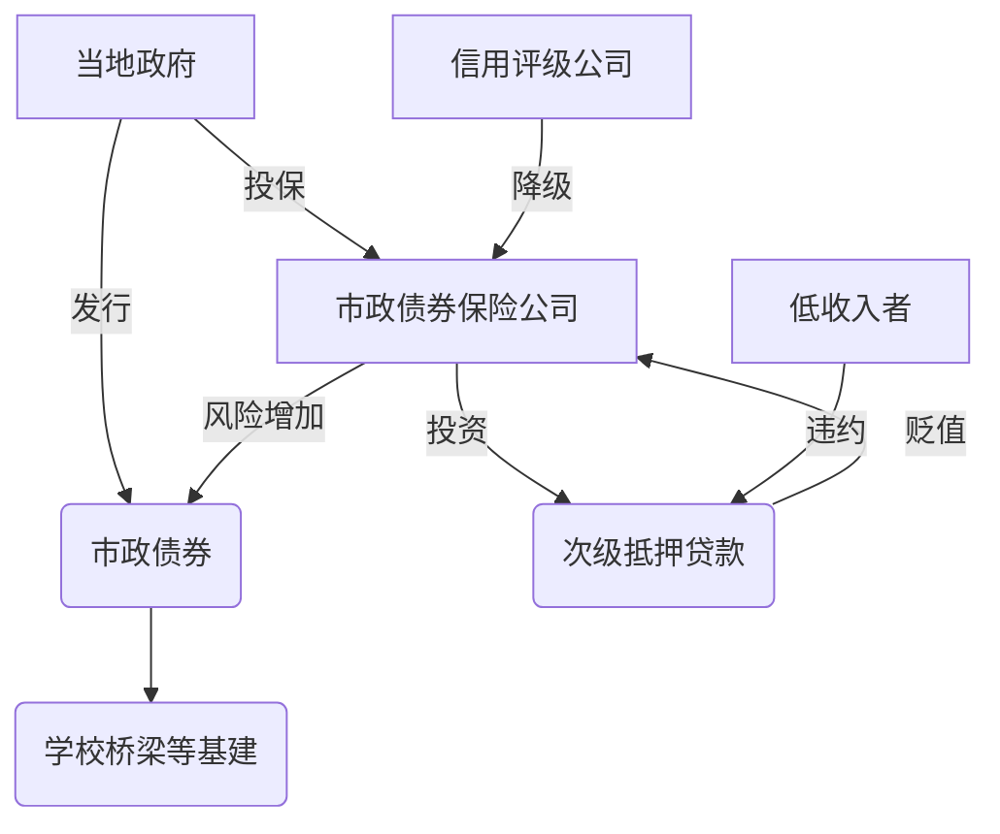

# 5.保险—典型的风险管理制度

## 保险业原理
### 起源
保险由证券演化而来，原理与证券一致（风险汇聚原理）。
    
    风险汇聚原理：
    将独立或相关性小的风险汇聚起来，以降低整体风险。
### 待解决问题
保险公司必须应对
* [ ] 道德风险问题。
* [ ] 选择性偏差
    
      如果你提供某个险种，吸引的是该险种风险较大的人群。
 ### 数学公式
 根据独立性假设，你赔付的保单数量的概率分布符合二项分布
 >x意外数量
 >n签订的保单数，p某意外发生频率
 
 **频率分布公式**
```math
f(x)=\frac{p^x(1-p)^{1-p}n!}{x!(n-x)!}
```
>**参考**：

>

>
 
均值mean(x/n)=p
标准差
```math
\sigma(\frac{x}{n})=\sqrt{\frac{p(1-p)}{n}}
```
    计算时，假设二项分布服从正态分布。
    公司足够大才能做保险，这样就能减小风险。
    签订保单数量越大，事故的占比越接近（在正态分布中越集中）。

### 保险的组成
#### 1.合同设计
被保险人与保险公司签订的合同，内容包括：
* 被保险的风险内容
* 除外责任exclusions（不被保险的风险是哪些）
    
        解决道德风险和选择性偏差
* 数学模型
* 保险机构必须有某种组织形式（企业/非营利性股份公司）
>保险公司也可以是互助保险公司，保险公司的股东就是被保险人


#### 政府制定
* 相关法规
* 监管机构（确保保险公司履行承诺）
* 保险准备金达到规定数额
*  [ ] 数额如何计算？

### 保险公司类型
#### 1.多线保险公司(综合险种保险公司)
>multiline insurance companies
多线公司的业务相当于能互相保险

#### 2.单线保险公司（单一险种保险公司）
> monoline insurance companies
风险更大，所以监管机构监管更严
    

2.1.财产保险公司（P&C，property and casualty）
专门提供住宅/商业/汽车财产保险。
* 最重要的业务——**汽车保险**(碰撞保险)
汽车保险收入是住房保险收入的6倍以上，而住房保险的保费也会较低（意外率比较低）


2.2.健康保险公司，专为人们的医疗费用提供保险。
2.3.人寿保险公司。针对被保险人的死亡，向受益人提供保险。（家庭保险计划）

        2007年，美国境内财产保险公司的总资产1.4万亿$，
        寿险公司4.9万亿$,
## 保险业的发展
### 1.起源
17世纪
* 概率论
* 寿命表life tables
* 精算学

### 2.推销
1840s纽约共同人寿老板（Mutual Life of NY）Morris Robinson提出高薪雇用寿险推销员。

    1840s，寿险很重要，当时人均期望寿命45岁。一对夫妇活到孩子成年的概率很低。
    
当时人们不想买寿险，原因在于：
* 高死亡率，保费高
* 抗拒心理
应对措施：
* 推销员与客户形成长期关系，
* 挑选的推销员为社区中有推销天赋且受人欢迎的人
* 高薪激励

### 3.保单取消问题
19世纪末，Henry Hyde，英国公平人寿保险公司（Equitable Life），创造了一种保单，**其具有现金价值**(带有储蓄性质)
* 可以补偿死亡损失
* 逐年增值

解决了人们取消保单的问题。
    
    人寿保险的主要问题：取消保单。
  
  >另一种方法:一旦保单取消，价值消失。

### 4.
美国社会学家Viviana Zelier研究19世纪寿险，发现女性对寿险有抵触。原因在于:
* 认为把丈夫的死作为生意，有悖道德和情感。
解决方案:
* 改变表达方式，不要向客户讲概率论
* 装扮成带来福音的传教士，“你丈夫的在天之灵会保佑你”

    迎合公众期望的营销。

### 保单形式
#### 寿险
1.定期人寿保险
* 保费不产生现金价值
2.终身人寿保险
* 会按照购买计划产生现金价值
>分为非参与式分红保险和参与式分红保险

    参与式分红保险——收益来自某个投资组合（由保险公司管理）收益，现金价值（分红）不确定
    
2.1.可变寿险
投保人可以自主选择进行多少投资，而不局限于保险公司的既定投资计划

2.2.综合性人寿保险
保费灵活，可以前一年多付，第二年少付，只要满足最低缴费要求即可

2.3生死两全保险
向身故受益人赔付直至其死亡


### 政府监管
#### 资本充足率
1.**各州监管**
美国的保险业并非由联邦政府直接监管，而是由每个州分开监管（一开始就如此）
    
    美国保险业发展的障碍。开办保险公司必须满足所有州的规定。
    每个州都指定了保险公司必须持有多少准备金。
    
* **法定盈余**(准备金)
提取准备金需要做会计分录
准备多提存是为了保护他们自己以及投保人

2.**协会监管**
NAIC美国保险监管官协会（准监管组织）
由各州保险监督官组成，并定期开会。开会内容：
>统一监管政策（无强制意义）
>建议达成决议

    对于各州监管来说，NAIC的决议只是一种建议，但基本会采纳

3.**格拉姆里奇比利雷法案Gramm-Leach-Bliley**
>1999年金融服务现代化法案

允许银行从事保险业务，或与保险公司合作整合并购
|
银行系统得到扩张，并且与保险业密切相连
    
    欧洲一直都有综合性银行提供保险服务

### 保险业的缺陷
1.市政债券保险公司
属于私人保险公司，从事单线保险业务
主要服务对象：州和当地政府（当地政府发行的债券为市政债券）
* [ ] 市政债券有破产的可能，风险较高，如果政府债券没有投保，投资者是不会买的
* 这些保险公司确保政府当局有能力向投资者进行赔付

    最大的市政债券保险公司MBIA，AMBAC，FGIC
    
* 次贷危机中这些公司的系统性作用 
保险公司将准备金进行投资，方向主要为次级抵押贷款。抵押贷款违约后，市政债券保险公司手中的次级贷款价值下跌，其法定盈余下降。
1.18，Fitch惠誉国际信用评级有限公司对AMBAC下降评级，引发公众恐慌，进而影响市政债券的发行，市政停止基建


