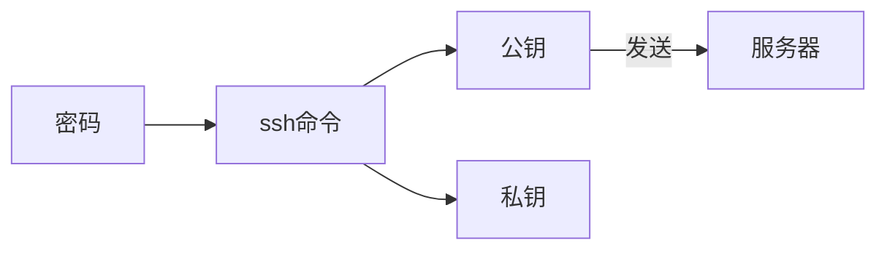

# Shadowsocks-libev安装及使用
本文使用工具
Neovim
## SSH登录服务器
### 生成密钥
流程

- 生成密码命令
```
openssl rand -base64 10#-base64为键盘可打类型，10为密码数字
```
```
ssh-keygen -t ecdsa -f test -C "备注"//f文件名，-t加密类型，ecdsa 椭圆曲线加密法
```
- 将生成的公钥发送至服务器
```
ssh-copy-id -i '/path/.ssh/test.pub' -p 服务器ssh端口 root@服务器地址
```

## 服务器端
服务器端第一步：
登录[ping 测试网站](ping.pe)，输入服务器地址测试是否可用，如果可用，再进行之后的操作

以下操作以Debian 9为例说明。

### debian9
```
sudo sh -c 'printf "deb http://deb.debian.org/debian stretch-backports main" > /etc/apt/sources.list.d/stretch-backports.list'
sudo apt update
sudo apt -t stretch-backports install shadowsocks-libev
```
- 安装好后，配置
#### 配置文件
```
cd /etc/shadowsocks-libev //进入文件夹
vim config.json  //编辑配置文件
```
具体配置如下
```
{  
 "server":["::0","0.0.0.0"],  
 "server_port":端口,  
 "local_port":1080,  
 "password":"密码",  
 "timeout":60,  
 "method":"aes-256-cfb",  
 "mode":"tcp_and_udp",  
 "fast_open":false
}
```
激活服务
```
systemctl enable shadowsocks-libev-server@config //激活服务，开机启动
systemctl start shadowsocks-libev-server@config //启动服务
systemctl status shadowsocks-libev-server@config //检查运行状态
ufw allow 端口 //让服务器的防火墙允许该端口出入

```
## 客户端
### archlinux安装
```
yay -S shadowsocks-libev //安装
```
其他系统安装[方法](https://github.com/shadowsocks/shadowsocks-libev)
### 编辑配置文件
```
cd /etc/shadowsocks-libev //进入文件夹
vim config.json  //编辑配置文件
```
配置文件config.json

```
{  
 "server":"服务器地址",  
 "server_port":服务器端口,  
 "local_port":1080,  
 "password":"密码",  
 "timeout":60,  
 "method":"aes-256-cfb"
}
```
###启动服务
```
sudo systemctl enable shadowsocks-libev@config.service //设置开机启动
sudo systemctl start shadowsocks-libev@config.service //启动服务
sudo systemctl status shadowsocks-libev@config.service//查询服务状态
```

## 切换线路
### 创建json文件
```
cd /etc/shadowsocks  //进入shadowsocks的线路配置文件夹
或者
cd /etc/shadowsocks-libev  //如果你安装的是libev版
nvim config.json 
```
- json文件格式：
```
{
	"server":"服务器地址",
	"server_port":服务器端口,
	"local_address":"127.0.0.1",
	"local_port":1080,
	"password":"密码",
	"method":"加密方法"
}
```


### 切换线路

```
systemctl disable shadowsocks-libev@former.service //关闭自动启动
systemctl stop shadowsocks-libev@former.service //关闭服务
systemctl start shadowsocks-libev@XXX.service//启动服务
systemctl enable shadowsocks-libev@XXX.service //开启自动启动
systemctl status shadowsocks-libev@XXX.service //检查运行状态
```
