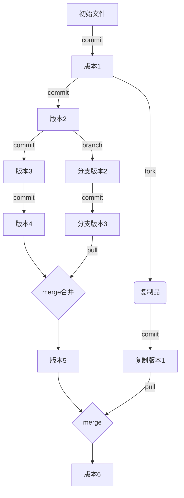

# Github

```mermaid
graph TD
A[初始文件] -->|commit| A1(版本1)
A1[版本1]-->|commit|A2[版本2]
A1-->|fork|B(复制品)
A2-->|commit|A3[版本3]
A2-->|branch|C[分支版本2]
A3-->|commit|A4[版本4]
C-->|commit|C1[分支版本3]
A4-->A5{merge合并}
C1-->|pull|A5
A5-->A6[版本5]
A6-->A7{merge}
B-->|comiit|B1[复制版本1]
B1-->|pull|A7
A7-->A8[版本6]
```

## 主要概念
### 网站端
* repo仓库
* commit提交
* branch分支
* merge合并
* fork复刻
* pull request拉

### 本地端
* clone
* 

## 流程图

# Git
## 主要命令
### 1.
* cd
* pwd
* ls
* clear
