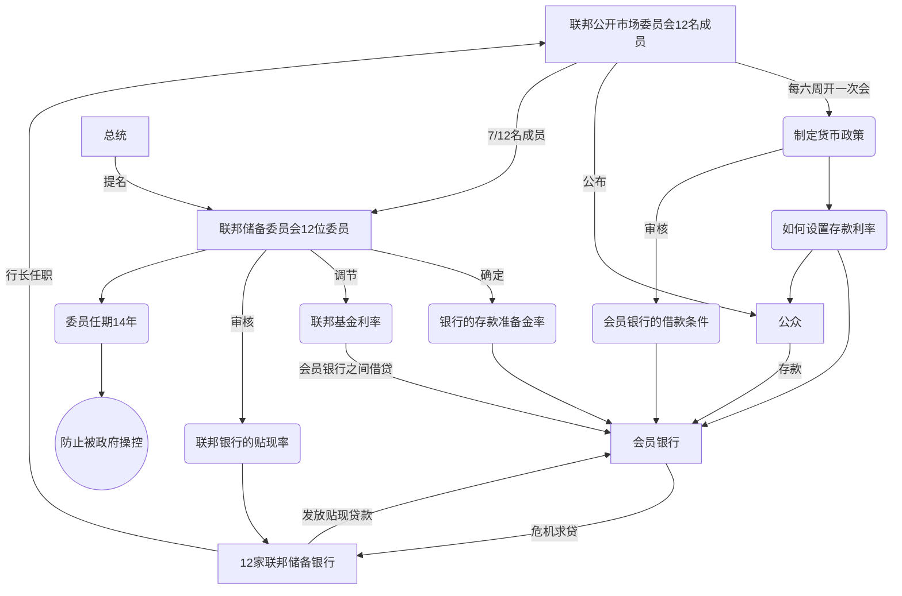

```mermaid
graph TD
A[联邦公开市场委员会12名成员]-->|每六周开一次会|E(制定货币政策)
A-->|公布|Z[公众]
E-->F1(如何设置存款利率)
F1-->S
F1-->Z
Z-->|存款|S
E-->|审核|F2(会员银行的借款条件)
F2-->S
B[12家联邦储备银行]-->|行长任职|A
P[总统]-->|提名|C
A-->|7/12名成员|C
C[联邦储备委员会12位委员]
C-->|确定|C1(银行的存款准备金率)
C1-->S[会员银行]
S-->|危机求贷|B
B-->|发放贴现贷款|S
C-->|调节|C2(联邦基金利率)
C2-->|会员银行之间借贷|S
C-->|审核|C3(联邦银行的贴现率)
C3-->B
C-->D(委员任期14年)
D-->G((防止被政府操控))
```
